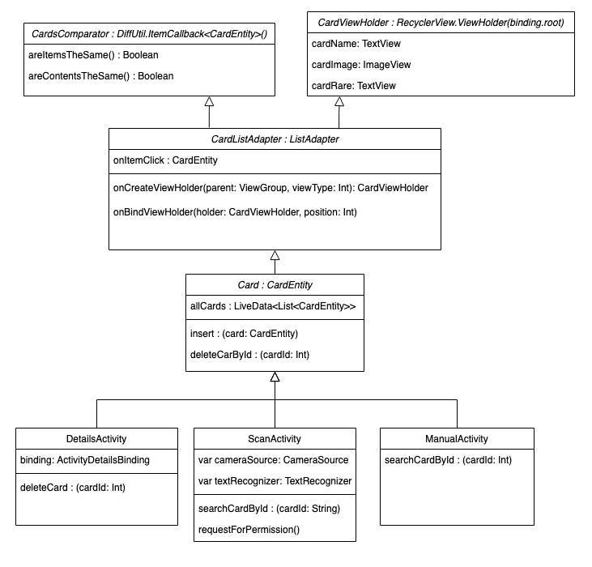

# YuGiOh Kotlin App
## _The Best App for scan your Yu-Gi-Oh card_

## Features

- Enter the ID of a card manually to add it to your list
- Scan a photo from an OCR recognition to retrieve the ID of the card and add it to the list
- Remove a card from your list easily with a button
- Find all the detailed information of your card once it is scanned
- The price of the card on eBay is also accessible in the details page of a card

## Tech

The project uses different modules, here they are :

- [Kotlin](https://kotlinlang.org/)
- [Retrofit2](https://square.github.io/retrofit/) - HTTP Request
- [Room](https://developer.android.com/training/data-storage/room) - Database
- [Picasso](https://square.github.io/picasso/) - A powerful image downloading and caching library for Android
- [Logging Interceptor](https://github.com/square/okhttp/tree/master/okhttp-logging-interceptor) - An OkHttp interceptor which logs HTTP request and response data
- [Google  Vision](https://developers.google.com/ml-kit/vision/text-recognition/android) - Recognize text in images

## Installation

Build the Gradle dependency and you can start  the app !

## Class Diagram

## License

MIT
